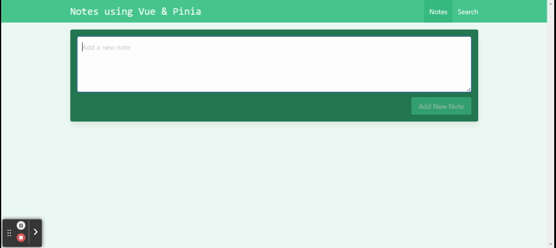

# Simple notes application using Vue3 and Pinia state management framework
1. Notes app developed using Vuejs(V3) and Pinia.  
2. User can create multiple notes. 
3. Notes gets saved in to local storage and will be available in multiple sessions. 
4. User can edit and delete notes

# Upcoming release will have
1. Search Notes
2. Code enhancements
3. add to favourites

## Live app on stackblitz 
Coming soon

# Kickstart
1. checkout the repository
2. npm install
3. npm run dev

## Demo - Notes app using pinia state managament framework

